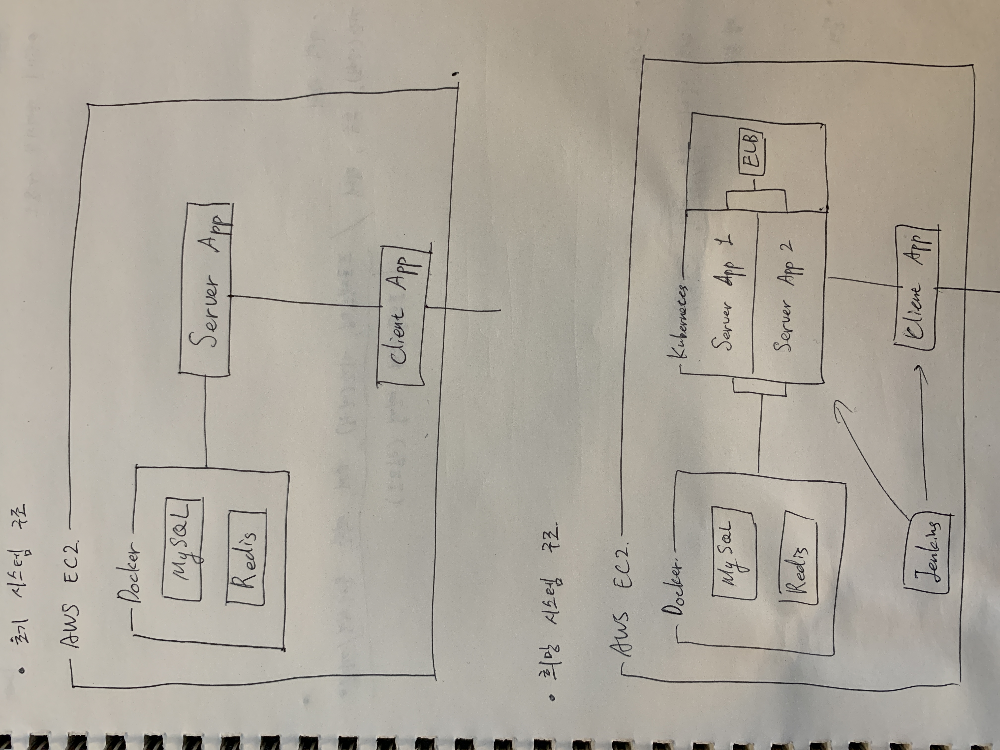

# 포트폴리오와 이력 관리 웹 서비

## -진행 상황-
현재 시스템 설계 단계. 상세 서비스 설계 구현 예정.

## 1. 개요
18년 8월부터 취업 준비를 하면서 개발자의 포트폴리오와 이력 관리가 아주 중요하다는 사실을 느끼면서 이번 프로젝트를 구상하게 되었다.
또한, 내가 관심있는 주제에 대한 포스팅, 개발 일지 등을 같이 작성하는 기능 등을 추가로 구상 중이다.

## 2. 목적
본 프로젝트를 진행함에 있어 다음과 같은 목표가 있다.

* '클린 코드' 서적을 읽고 이를 적용하여 가독성 높은 코드를 구현한다.
* '테스트 주도 개발' 서적을 읽고 이를 적용하여 단위 테스트가 쉬운 코드를 구현하여 애플리케이션의 안정성을 높인다.
* AWS EC2에 배포함으로써 실제로 사용할 목적으로 개발한다.
* EC2, ELB, Docker Swarm, Kubernetes 등을 도입하여 새로운 기술을 배운다. 필요하다면 토이 프로젝트를 진행한다.
* 인프라 구축과 관련된 운영체제, 네트워크 지식을 공부한다.

## 3. 설계
### 기술
| 분류 | 사용 기술 |
|---:|---|
| 서버 | AWS EC2 (Back, Front) |
| 언어 / 프레임워크 | Java / Spring Boot(Back)   React(Front) |
| DB | MySQL(Docker) |
| Cache | Redis(Docker) |
| Containter | Docker |
| Orchastration | Kubernetes |
| VCS | GitHub |
| CI | Jenkins (미정) |
| Monitoring | 미정 |

### 시스템 구조

### 세부 기능
설계 중.
* 이력
* 포트폴리오
* 포스팅
* 일기
